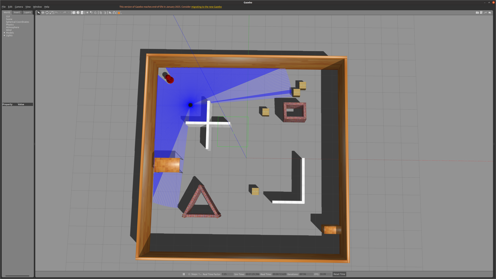
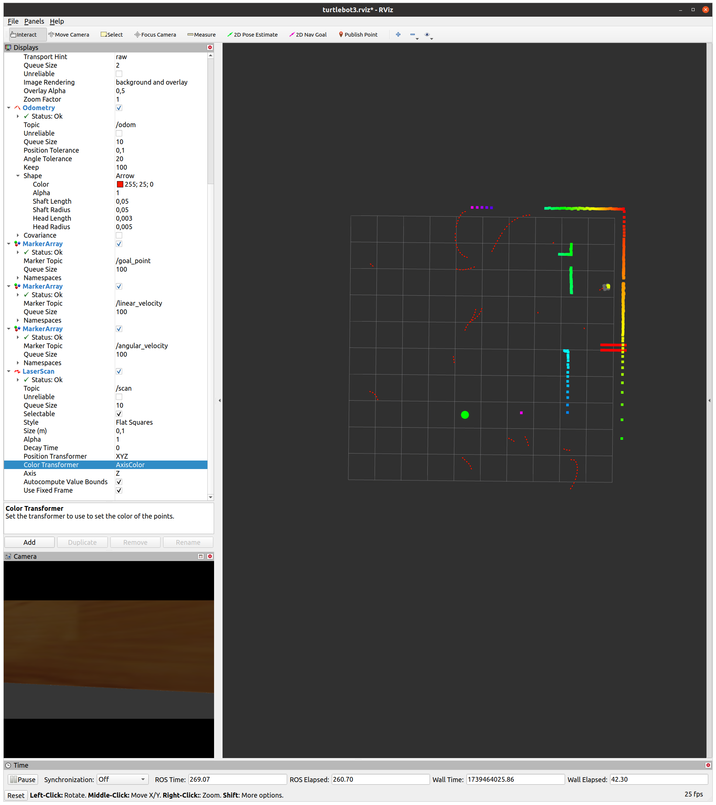
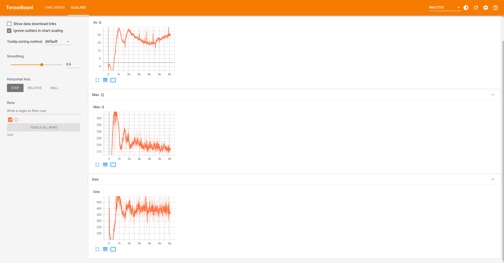

# Turtlebot3 DRL Navigation

This repository is a fork of [DRL-robot-navigation](https://github.com/reiniscimurs/DRL-robot-navigation) with modifications to run with the Turtlebot3 and its 2D lidar sensor. All the base behavior should be credited to the original author. The fork however changes the structure of the project so everything can be executed directly via ROS.


## Installation

1. Clone the repository
    ```bash
    git clone https://github.com/TannerGilbert/DRL-robot-navigation --recursive
    ```
2. Install Python dependencies
    ```bash
    pip3 install -r requirements.txt
    ```
3. Build workspace
    ```bash
    catkin build
    ```

## Usage

### Train

Training can be started via:

```bash
roslaunch td3_rl train_td3.launch
```





The training can be configured inside the [td3_config.yaml](src/TD3/config/td3_config.yaml) file.

Check training progress with Tensorboard:
```bash
$ cd src/TD3
$ tensorboard --logdir runs
```



### Inference

After training, the model can be tested with the following command:

```bash
roslaunch td3_rl test_td3.launch
```

The default behaviour for the inference script is to run indefinitetly until the robot crashes. If the environment should also be reset after a certain time `td3_params/max_ep` needs to be set to a positive value.

## Acknowledgements

This repository builds on [the work](https://github.com/reiniscimurs/DRL-robot-navigation) of [Reinis Cimurs](https://github.com/reiniscimurs).